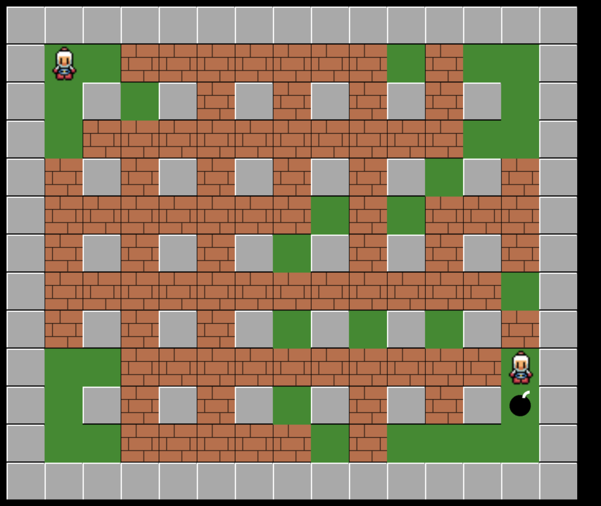

# Bomberman HTML Game

<p align="center">
  
</p>

## Overview

This project is a simple implementation of the classic Bomberman game using HTML5 Canvas. It provides a basic framework for a one-player game with player-controlled and AI-controlled characters.

# Features

- Grid-based game layout
- Player-controlled character with bomb placement
- AI-controlled character with basic movement and bomb placement logic
- Soft walls that can be destroyed by bombs
- Basic explosion effects

## Getting Started

1. Clone the repository:

```
    git clone https://github.com/your-username/bomberman-html-game.git
```

2. Open index.html in a web browser to play the game.

## Gameplay

- Use arrow keys or WASD to move the player character.
- Press the spacebar to place a bomb.
- The AI-controlled character will automatically make moves and place bombs.

## Customization

Feel free to customize and expand the game by adding new features, improving AI logic, or enhancing the graphical assets.

## Contributing

Contributions are welcome! If you'd like to contribute to the project, please follow these steps:

1.  Fork the repository.
2.  Create a new branch: git checkout -b feature/your-feature.
3.  -Commit your changes: git commit -m 'Add some feature'.
4.  Push to the branch: git push origin feature/your-feature.
5.  Open a pull request.

## License

This project is licensed under the MIT License - see the LICENSE.md file for details.

## Acknowledgments

1. This game is inspired by the classic Bomberman game.
2. This projetc is based on https://gist.github.com/straker/769fb461e066147ea16ac2cb9463beae
